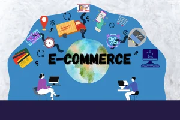

# E-commerce

This project is set in Platzi, (they are a start-up of e-learning) in which you will be able to buy merchandising and pay with Paypal. Also, it has geolocalización for getting easier the address.

## Account Paypal Sandbox

When you go pay with paypal, please input this count. This count is a test count

Email: sb-je6pu6146961@personal.example.com

Password: Uxdo7"r&

## Page

https://e-platzicommerce.web.app/

## Technologies

- React
- Paypal API
- Leaflet (Maps provider as Google Maps)
- Sass
- Axios
